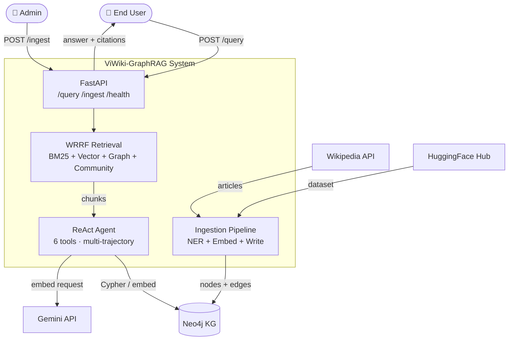
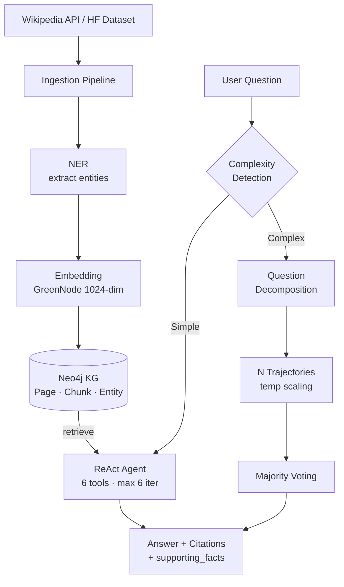

# 2. Overall System Description

## 2.1 System Perspective

ViWiki-GraphRAG is a **standalone research prototype** — it does not replace or extend an existing system. It combines knowledge graph technology with modern retrieval-augmented generation to enable multi-hop question answering over Vietnamese Wikipedia.

### System Context Diagram

### Data Flow

## 2.1.1 Stakeholder Validation

The system requirements were validated with the following stakeholders:

| Stakeholder | Role | Validation Method |
|-------------|------|-------------------|
| FPT University Capstone Advisor | Academic supervisor | Requirement review meeting, Sprint 1 demo feedback |
| Vietnamese NLP researchers (2) | Domain experts | Informal interview — confirmed multi-hop QA gap in Vietnamese |
| FPT University students (5) | Target end users | User survey — 4/5 reported difficulty finding cross-article answers on Vietnamese Wikipedia |

**Key finding from user survey:** 80% of respondents (4/5) spent > 10 minutes per complex research question navigating between Wikipedia articles manually. This directly motivates FR-05 (multi-hop QA with citations).

---

## 2.2 User Classes and Characteristics

| User Class | Description | Interaction | Priority |
|-----------|-------------|-------------|----------|
| **Researcher** | Vietnamese NLP/IR researchers evaluating system | Complex multi-hop queries, evaluation API | High |
| **Student** | University students seeking factual answers | Simple and moderate queries via Gradio UI | High |
| **Developer** | Engineers integrating QA into other systems | REST API (`POST /query`) | Medium |
| **Admin** | Team members managing ingestion pipelines | Ingestion endpoints, monitoring | Low |

## 2.3 Operating Environment

| Component | Requirement |
|-----------|-------------|
| OS | Ubuntu 22.04+ (development), any Linux (deployment) |
| Python | 3.11+ with `uv` package manager |
| Database | Neo4j 5.x Community Edition (systemd service) |
| GPU | NVIDIA GPU ≥ 8GB VRAM (CUDA 12.x) for local LLM |
| RAM | ≥ 16GB (32GB recommended for bulk ingestion) |
| Storage | ≥ 50GB (Neo4j data + model weights + embeddings) |
| Network | Internet access for Gemini API and HuggingFace downloads |

## 2.4 Design Constraints

1. **Vietnamese-only**: System is designed exclusively for Vietnamese language content. This is a deliberate design decision to optimize NER, embeddings, and prompts for Vietnamese linguistic characteristics (diacritics, word segmentation, compound nouns).

2. **15-week timeline**: Capstone project duration constrains scope. Prioritize working pipeline over perfect components.

3. **3-person team**: Limited parallelization of development work. Each member owns a vertical slice (ingestion/retrieval/agent).

4. **Free-tier API limits**: Gemini API has rate limits. System implements multi-key rotation and local embedding fallback.

5. **Research prototype**: Not designed for production load. Single-server deployment, no horizontal scaling.

6. **Neo4j Community Edition**: No clustering, no role-based access control. Acceptable for research prototype.

## 2.4.1 Assumptions and Dependencies

| # | Assumption | Impact if Invalid |
|---|-----------|-------------------|
| A1 | Neo4j runs as a local systemd service (not clustered) | Would need Docker/K8s setup; latency model changes |
| A2 | Single NVIDIA GPU with ≥ 8GB VRAM available | Local LLM and reranker cannot run; must fall back to API mode |
| A3 | System is Vietnamese-only; no multilingual support | If multilingual needed, embedding model and NER must be replaced |
| A4 | Internet available for initial model download and Gemini API | Offline-first after initial setup; Gemini is optional fallback |
| A5 | Wikipedia content is static per ingestion batch | Real-time sync not supported; re-ingestion required for updates |
| A6 | QLoRA fine-tuning improves Text2Cypher accuracy | Fallback: prompt engineering + few-shot examples + WRRF weight optimization if fine-tuning fails |

### Risk Mitigation for AI Development

| Risk | Likelihood | Mitigation |
|------|-----------|------------|
| QLoRA fine-tuning yields no improvement over base model | Medium | Fallback to prompt optimization + WRRF parameter sweep. Both are lower-effort paths that still produce measurable results. |
| Hit rate target (70%) not achieved by Review 2 | Low-Medium | Current 64.67% → 70% gap can be closed via reranker tuning and graph signal weight adjustment without model changes. |
| GPU OOM during multi-trajectory inference | Low | Reduce `AGENT_N_TRAJECTORIES` to 1, or use sequential execution instead of parallel. |

## 2.5 Product Functions Summary

| Function | Description | Status |
|----------|-------------|--------|
| Wikipedia Ingestion | Ingest articles from API or HF dataset into Neo4j | ✅ Implemented |
| Named Entity Recognition | Extract Person, Org, Location, Work entities | ✅ 6 backends |
| Embedding Generation | Semantic vectors for chunks (1024-dim) | ✅ Gemini + local |
| Hybrid Retrieval | WRRF fusion of BM25 + vector + graph + community | ✅ Implemented |
| Cross-encoder Reranking | BAAI/bge-reranker-v2-m3 for result refinement | ✅ Implemented |
| ReAct Agent | 6-tool agent for multi-step reasoning | ✅ Implemented |
| Multi-trajectory Voting | Parallel agent runs with majority consensus | ✅ Implemented |
| Question Decomposition | Break complex questions into sub-questions | ✅ Implemented |
| Evaluation Pipeline | Context hit rate, MRR, latency benchmarks | ✅ Implemented |
| Dataset Generation | KG walk → template → LLM rewrite → QC | 🔄 In progress |
| Gradio Demo | Interactive web UI for QA | ✅ Implemented |
