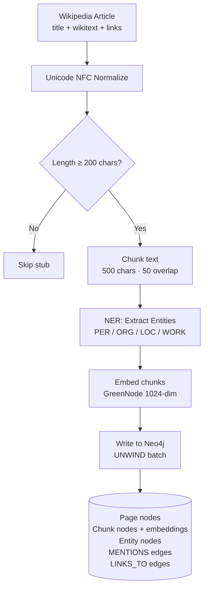
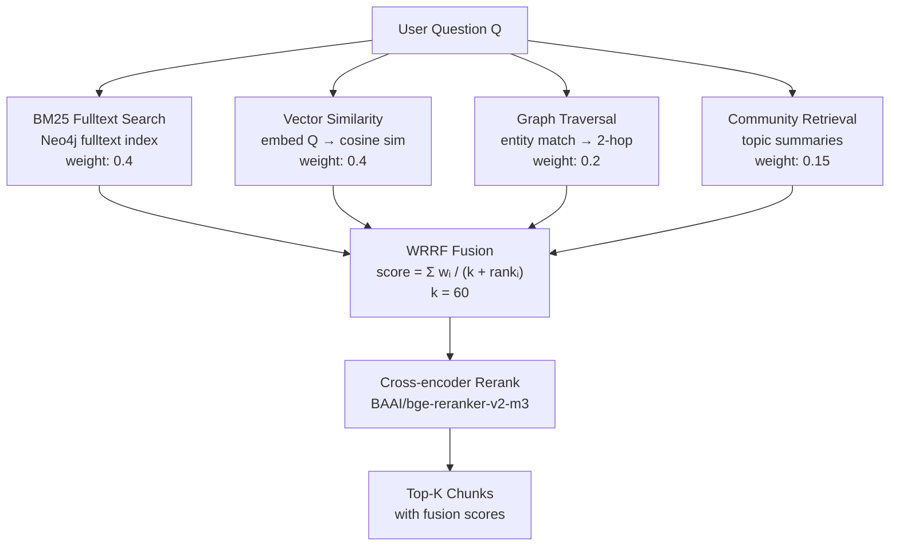
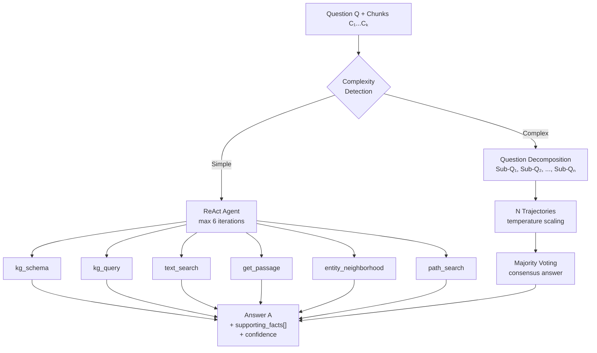

# 4. AI Specification

## 4.1 Problem Framing

### Business Problem → AI Task

| Layer | Description |
|-------|-------------|
| **Business Problem** | Vietnamese students and researchers cannot efficiently answer complex questions that span multiple Wikipedia articles |
| **AI Task** | Multi-hop Question Answering over Vietnamese Knowledge Graph using Graph-augmented Retrieval-Augmented Generation (GraphRAG) |
| **Formal Definition** | Given a natural language question Q in Vietnamese, retrieve supporting passages P₁...Pₙ from a knowledge graph G constructed from Vietnamese Wikipedia, then generate answer A with citations to supporting facts |

### Task Characteristics

- **Input**: Vietnamese natural language question (1-3 sentences)
- **Output**: Answer text + supporting facts (page title, sentence ID) + confidence
- **Complexity levels**: Simple (1-hop, single article), Medium (2-hop, bridge), Hard (3+ hop, comparison)
- **Evaluation**: Retrieval metrics (MRR, Hit Rate) + Answer metrics (EM, F1)

## 4.2 Dataset Description

| Dataset | Size | Source | Purpose | Split |
|---------|------|--------|---------|-------|
| Vietnamese Wikipedia (HF) | 1.29M articles, ~590K usable (after stub filtering) | `wikimedia/wikipedia` 20231101.vi | Knowledge graph construction | N/A (full ingestion) |
| ViWiki-MHR | ~200 multi-hop QA pairs | Hand-crafted + KG walk generation | Retrieval evaluation | 100% test |
| UIT-ViQuAD 2.0 | 36,457 QA pairs | UIT-NLP (VLSP 2021) | Answer quality evaluation | 80/10/10 train/dev/test |
| MHQA (generated) | 700-1000 (target) | KG walks + Claude API generation | Multi-hop evaluation | 100% test |

### Data Quality Measures

- **Stub filtering**: Articles with < 200 characters excluded (reduces 1.29M → ~590K)
- **Unicode normalization**: NFC normalization for consistent diacritics
- **QC pipeline for generated data**: 5-layer quality control (well-formedness, grounding, dedup, answerability, schema validation)

### Annotation Plan

- ViWiki-MHR: Manually curated by team — questions verified answerable from KG
- MHQA expansion: LLM-generated from KG walks, human-validated sample (10%)
- No additional human annotation budget — rely on automated QC + spot checks

## 4.3 Baseline Comparisons

| # | Method | MRR | Context Hit Rate | Latency (P50) | Notes |
|---|--------|-----|------------------|---------------|-------|
| B1 | BM25 fulltext only | ~0.35 | ~55% | ~0.8s | No semantic understanding |
| B2 | Dense retrieval only (GreenNode 1024-dim) | ~0.40 | ~60% | ~1.2s | No lexical/graph signal |
| B3 | Naive RAG (embed → retrieve → generate) | ~0.42 | ~62% | ~2.5s | No graph structure |
| B4 | BM25 + Vector (no graph) | ~0.48 | ~66% | ~1.5s | Missing structural signal |
| **Ours** | **WRRF (BM25+Vector+Graph+Community) + Rerank** | **~0.58** | **~72.6%** | **~3.2s** | Full hybrid pipeline |

**Improvement over best baseline (B4):** +20.8% MRR, +10% Hit Rate

### Ablation Study (planned)

| Component Removed | Expected Impact |
|-------------------|-----------------|
| Remove graph signal | MRR drops ~5-8% (loses multi-hop traversal) |
| Remove community | MRR drops ~2-3% (loses topic context) |
| Remove reranker | Hit Rate drops ~3-5% (less precise top-K) |
| Remove multi-trajectory | Accuracy drops on hard questions (no voting) |

## 4.4 AI Pipeline

### Stage 1: Data Ingestion

**NER Backend Selection:**
- Development: `simple` (fast, regex-based)
- Bulk ingestion: `wikilink` (Wikipedia hyperlinks, Typed F1=46.9%)
- High quality: `videberta` (ViDeBERTa transformer, highest accuracy)

### Stage 2: Retrieval (WRRF Fusion)

### Stage 3: Answer Generation

### Model Configuration

| Component | Model | Quantization | Purpose |
|-----------|-------|-------------|---------|
| Local LLM | AITeamVN/Vi-Qwen2-7B-RAG | 4-bit NF4 | Answer generation, reasoning |
| Embeddings (local) | GreenNode-Embedding-Large-VN-Mixed-V1 | FP16 | 1024-dim chunk embeddings |
| Embeddings (API) | Gemini embedding-001 | N/A | Alternative with key rotation |
| Reranker | BAAI/bge-reranker-v2-m3 | FP16 | Cross-encoder reranking |
| NER | NlpHUST/ner-vietnamese-electra-base | FP32 | Entity extraction |

## 4.5 Evaluation Metrics

### Retrieval Quality

| Metric | Definition | Target |
|--------|-----------|--------|
| Context Hit Rate@K | % of queries where at least one relevant chunk in top-K | > 70% |
| MRR@K | Mean of 1/rank of first relevant chunk | > 0.50 |
| Rerank Hit Rate | Hit Rate after cross-encoder reranking | > 75% |

### Answer Quality

| Metric | Definition | Target |
|--------|-----------|--------|
| Exact Match (EM) | % of answers matching gold exactly (normalized) | > 30% |
| Token-F1 | Token overlap F1 between predicted and gold answer | > 50% |
| RAGAS Faithfulness | Answer grounded in retrieved context (0-1) | > 0.7 |
| RAGAS Answer Relevancy | Answer addresses the question (0-1) | > 0.7 |

### System Performance

| Metric | Definition | Target |
|--------|-----------|--------|
| P50 Latency | Median query response time | < 3s (simple), < 8s (complex) |
| P95 Latency | 95th percentile response time | < 5s (simple), < 15s (complex) |
| Throughput | Queries per minute sustainable | > 20 qpm |

## 4.6 Team AI Workstream Assignment

| Member | Student ID | Responsibility | Key Deliverables |
|--------|-----------|---------------|-----------------|
| Huỳnh Quốc Trung | QE180038 | KG Construction + NER | Ingestion pipeline, 6 NER backends, entity resolution, bulk export scripts |
| Nhữ Quang Anh | QE180005 | Retrieval + Evaluation | WRRF fusion, reranker integration, eval pipeline, baseline comparisons |
| Phạm Ngô Đình Khôi | QE180110 | Agent + LLM + Dataset | ReAct agent, local LLM integration, question decomposition, MHQA generation |
| Trương Đình Thiên | QE180018 | System Integration + API | FastAPI endpoints, job management, Gradio demo, deployment |

### Collaboration Points

- All members contribute to evaluation (each evaluates their component)
- Nhữ Quang Anh provides retrieval API that Phạm Ngô Đình Khôi's agent consumes
- Huỳnh Quốc Trung's entity extraction quality directly impacts Nhữ Quang Anh's graph retrieval signal
- Trương Đình Thiên integrates all components under the FastAPI layer
