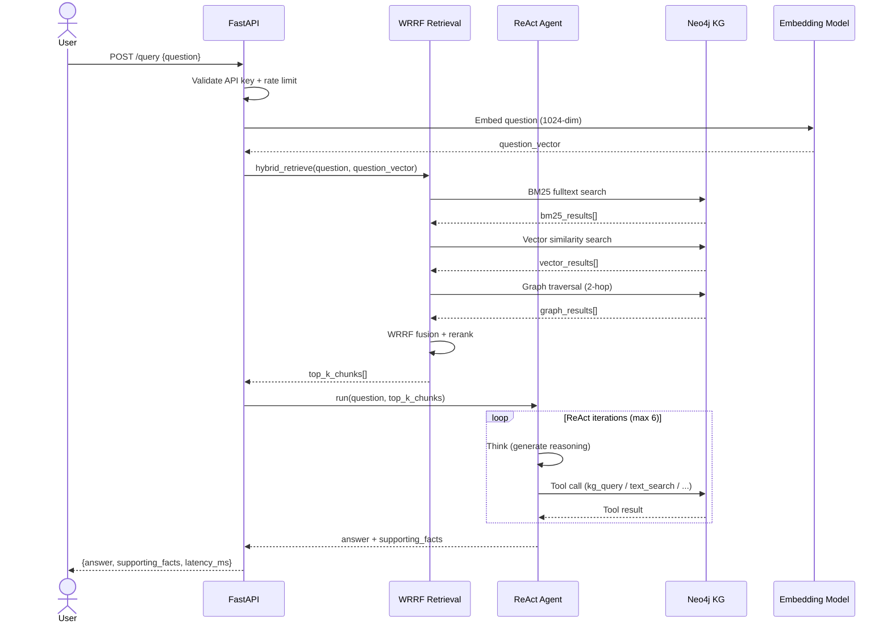

# 7. Use Case Specifications

## UC-01: Ask Simple Factual Question

| Field | Detail |
|-------|--------|
| **ID** | UC-01 |
| **Name** | Ask Simple Factual Question |
| **Actor** | End User (Student / Researcher) |
| **Preconditions** | Neo4j KG contains ingested Vietnamese Wikipedia articles; API server is running |
| **Postconditions** | User receives a direct answer with citation to source article |
| **Priority** | Must-Have |

### Main Flow

1. User sends `POST /query` with `{"question": "Hồ Chí Minh sinh năm bao nhiêu?", "mode": "agent"}`
2. System detects question complexity → **Simple** (single entity lookup)
3. System embeds the question using GreenNode embedding model
4. System runs WRRF hybrid retrieval (BM25 + vector + graph) → top-10 chunks
5. System invokes ReAct Agent with the retrieved chunks
6. Agent calls `text_search` tool with query "Hồ Chí Minh sinh năm"
7. Agent calls `get_passage` tool to retrieve supporting sentence
8. Agent synthesizes answer: "Hồ Chí Minh sinh ngày 19 tháng 5 năm 1890"
9. System returns answer with `supporting_facts: [{title: "Hồ Chí Minh", sent_id: 2}]`
10. Response time < 5 seconds (P95)

### Alternative Flow A: Question not found in KG

- At step 4: No relevant chunks retrieved (score < threshold)
- System returns: `{"answer": "Không tìm thấy thông tin liên quan trong cơ sở dữ liệu.", "supporting_facts": []}`

### Alternative Flow B: API key missing

- At step 1: Request header missing `X-API-Key` (if `APP_API_KEY` configured)
- System returns HTTP 401 Unauthorized

### Exception: Neo4j unavailable

- At step 3: Neo4j connection fails → System returns HTTP 503; logs error with request ID

---

## UC-02: Ask Complex Multi-hop Question

| Field | Detail |
|-------|--------|
| **ID** | UC-02 |
| **Name** | Ask Complex Multi-hop Question |
| **Actor** | End User (Researcher) |
| **Preconditions** | Neo4j KG populated; at least 2 related articles ingested; API server running |
| **Postconditions** | User receives answer synthesized from multiple source articles with full citation chain |
| **Priority** | Must-Have |

### Main Flow

1. User sends `POST /query` with complex multi-hop question (e.g., "Trường đại học mà người đoạt giải Fields Medal người Việt Nam đầu tiên từng theo học được thành lập vào năm nào?")
2. System detects question complexity → **Complex** (requires 2+ hops)
3. System runs question decomposition into sub-questions:
   - Sub-Q1: "Người Việt Nam đầu tiên đoạt giải Fields Medal là ai?" → "Ngô Bảo Châu"
   - Sub-Q2: "Ngô Bảo Châu học tại trường đại học nào?" → "Đại học Khoa học Tự nhiên"
   - Sub-Q3: "Đại học Khoa học Tự nhiên được thành lập năm nào?" → "1956"
4. Agent uses tools: `entity_neighborhood`, `path_search`, `kg_query` across sub-questions
5. Agent synthesizes final answer from sub-answers with full decomposition
6. System returns answer + supporting_facts from multiple pages + decomposition chain
7. Response time < 15 seconds (P95)

### Alternative Flow: Multi-trajectory mode (N=3)

- System spawns 3 independent trajectories with temperature scaling (0.3, 0.7, 1.0)
- Majority voting selects consensus answer (2/3 agreement required)
- If no consensus: return trajectory with highest confidence score

### Exception: Agent exceeds max iterations (6)

- Agent terminates with best partial answer; response includes `"truncated": true`

---

## UC-04: Bulk Ingest from HuggingFace Dataset

| Field | Detail |
|-------|--------|
| **ID** | UC-04 |
| **Name** | Bulk Ingest from HuggingFace Dataset |
| **Actor** | Admin (Huỳnh Quốc Trung / team member running ingestion) |
| **Preconditions** | Neo4j running; HF dataset accessible; `.env` configured |
| **Postconditions** | Articles chunked, NER-processed, embedded, stored in Neo4j with all relationships |
| **Priority** | Must-Have |

### Main Flow

1. Admin sends `POST /ingest/huggingface` with `{"dataset": "wikimedia/wikipedia", "config": "20231101.vi", "limit": 10000}`
2. System creates background job → returns `{"job_id": "hf-abc123", "status": "running"}`
3. Background thread processes: stream → filter stubs → normalize → chunk → NER → embed → batch UNWIND to Neo4j
4. Admin polls `GET /ingest/jobs/hf-abc123` for progress
5. On completion: `{"status": "completed", "processed": 10000, "failed": 12, "elapsed_s": 3600}`
6. Job state persisted to `.hf_ingest_jobs.json` (atomic write via tmp+rename)

### Alternative Flow A: Admin cancels job

- Admin sends `POST /ingest/jobs/hf-abc123/cancel`
- Thread exits at next article boundary → status: `running` → `cancelling` → `cancelled`

### Alternative Flow B: Server restart during ingestion

- On restart: jobs in `running`/`cancelling` state → marked `interrupted`
- Admin can inspect and restart manually

### Exception: Neo4j write failure

- Retry batch with exponential backoff (3 attempts); on permanent failure → log error, mark job `failed`

---

## Sequence Diagram: POST /query Flow

