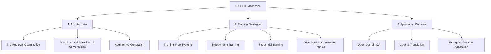

tags:: [[paper]], [[survey]], [[graph-rag]], [[agentic-systems]]

# [[Fan et al. 2024 - RAG Meeting LLMs Survey]]

## TL;DR
This KDD 2024 survey reviews the integration of Retrieval-Augmented Generation (RAG) with Large Language Models (RA-LLMs). The paper organizes the literature around architectures, training strategies, and applications, arguing that external knowledge integration is critical to resolving parametric limits and factual hallucinations in LLMs.

## Taxonomy & Landscape Classification
The authors categorize the RA-LLM landscape along three main dimensions:

## Core Paradigms
The survey analyzes the integration of retrieval-augmented systems through two primary technical lenses:

### 1. The Retrieval-Augmentation-Generation Architecture
*   **Retrieval Stage:** Employs dense vector databases, sparse indices, or hybrid lookup methods to gather relevant source documents.
*   **Augmentation Stage:** Examines how retrieved knowledge is integrated into the generator, comparing direct prefixing, inter-attention injections, and sliding context window insertions.
*   **Generation Stage:** Focuses on standard auto-regressive generation using the retrieved contextual grounding.

### 2. Retriever-Generator Training Dynamics
*   **Training-Free:** Zero computational overhead; frozen pre-trained retrievers and generators are combined out of the box.
*   **Independent:** Retriever (e.g., dual-encoders) and Generator (LLM) are fine-tuned on separate tasks without inter-dependency.
*   **Sequential:** One module is frozen while the other is adapted to its outputs (e.g., freezing the LLM and fine-tuning the retriever to maximize downstream LLM accuracy).
*   **Joint:** Both components are optimized end-to-end via joint objective gradients, yielding the highest task performance but requiring intensive computational resources.

## Open Challenges & Research Horizons
1.  **Semantic Degradation:** Indiscriminately feeding retrieved context into LLMs can clutter the prompt and degrade reasoning capability. Knowing *when* to retrieve remains an open challenge.
2.  **Multilingual & Multimodal RAG:** Scaling retrieval indices to low-resource languages and cross-lingual alignment (e.g., mapping native language queries to English-based knowledge bases).
3.  **Parametric vs. Non-Parametric Consistency:** Resolving conflicts when the retrieved context directly contradicts the model's pre-trained parametric weights.

## Relevance to our Vietnamese KGQA System
*   **What we borrow:** The training strategy classification. We will adopt the **Training-Free** approach for the core generator LLM while using **Sequential Training** (QLoRA) to fine-tune the adapter layers of our local SLM to execute exact Cypher statements.
*   **What we adapt:** The warning against indiscriminate retrieval. We will implement an intent classifier (similar to URASys) to selectively route questions, bypassing graph retrieval for out-of-domain queries to maintain low latency and prevent context clutter.
*   **What we avoid:** End-to-end joint training of the retriever and generator, which is highly resource-intensive and impractical for our single-GPU training budget.
