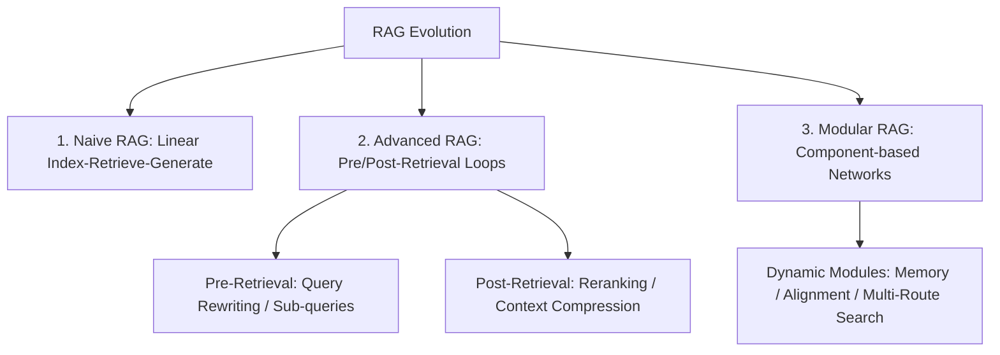

tags:: [[paper]], [[survey]], [[graph-rag]], [[knowledge-graph]]

# [[Gao et al. 2024 - RAG for LLMs Survey]]

## TL;DR
This foundational survey paper tracks the architectural evolution of RAG systems, organizing them into Naive, Advanced, and Modular frameworks. The authors detail key techniques designed to mitigate common LLM bottlenecks, such as context constraints, factual hallucinations, and static knowledge limits.

## Taxonomy & Landscape Classification
The authors structure the technological progression of RAG into three distinct evolutionary paradigms:

| RAG Paradigm | Core Architecture | Key Techniques | Primary Limitations |
| :--- | :--- | :--- | :--- |
| **Naive RAG** | Linear flat pipeline: Index -> Retrieve -> Generate | Sparse/dense vector retrieval, prompt concatenation | Precision bottlenecks, high noise, retrieval hallucination |
| **Advanced RAG** | Pre-retrieval and post-retrieval optimization loops | Query expansion, chunk routing, Cross-Encoder reranking | High token latencies, sequential pipeline rigidity |
| **Modular RAG** | Component-based, non-linear routing networks | Iterative search, active retrieval routing, fine-tuned alignment | Complex orchestration, high multi-agent latencies |

## Core Paradigms

### 1. Pre-Retrieval Optimization (Advanced RAG)
Focuses on enhancing the query and the data structure prior to search:
*   **Query Rewriting:** Translating colloquial queries into optimal search engine keywords.
*   **Sub-Queries:** Breaking a complex question into multiple sub-questions executed in parallel.
*   **Chunk Optimization:** Adjusting slide windows and chunk hierarchies to retain context.

### 2. Post-Retrieval Optimization (Advanced RAG)
Aims to prune and prioritize retrieved knowledge before presentation to the LLM:
*   **Reranking:** Using deep Cross-Encoders to score and sort retrieved documents, ensuring the most semantically relevant chunks sit at the top of the context window.
*   **Compression:** Stripping out grammatical fluff and irrelevant sentences from retrieved paragraphs to save token costs.

### 3. Modular RAG Architectures
A highly flexible, component-based paradigm that replaces rigid linear pipelines with dynamic, non-linear execution patterns. It supports dynamic module swapping (e.g., swapping retrievers), iterative multi-step search loops, and active retrieval routing based on token confidence.

## Open Challenges & Research Horizons
1.  **Context Clutter:** Ingesting noisy or excessive chunks degrades LLM performance, a phenomenon known as the "lost in the middle" effect.
2.  **Robust Evaluation Standards:** Moving beyond basic string matching to systematically evaluate RAG pipelines. The authors propose the **RAG Triad**:
    *   **Context Relevance:** Did the retriever fetch the correct facts?
    *   **Faithfulness / Groundedness:** Did the generator stick *strictly* to the retrieved facts?
    *   **Answer Relevance:** Did the final answer directly resolve the user query?
3.  **Real-Time Latency:** The computational overhead of pre-retrieval expansions and post-retrieval reranking blocks sub-second user interactions.

## Relevance to our Vietnamese KGQA System
*   **What we borrow:** The **RAG Triad** evaluation criteria. We will implement these by building a component-based pipeline where our Neo4j database, intent classifiers, and validation engines run as specialized modules, evaluated via RAGAS and TruLens.
*   **What we adapt:** Citation Tracking and Post-Processor Grounding. We tag every retrieved passage with `passage_ids`. When our orchestrator emits a final response containing `[passage_id]` markers, our post-processor programmatically verifies that all cited passages exist in the retrieved trace. If the SLM cites passages it never retrieved, the answer is flagged as ungrounded (enforcing absolute Faithfulness).
*   **What we avoid:** Naive RAG's flat text vector index. We will bypass the inherent retrieval inaccuracies of flat vector chunking (which suffers severely from Vietnamese tokenization limits) by executing structural Text2Cypher traversals.
