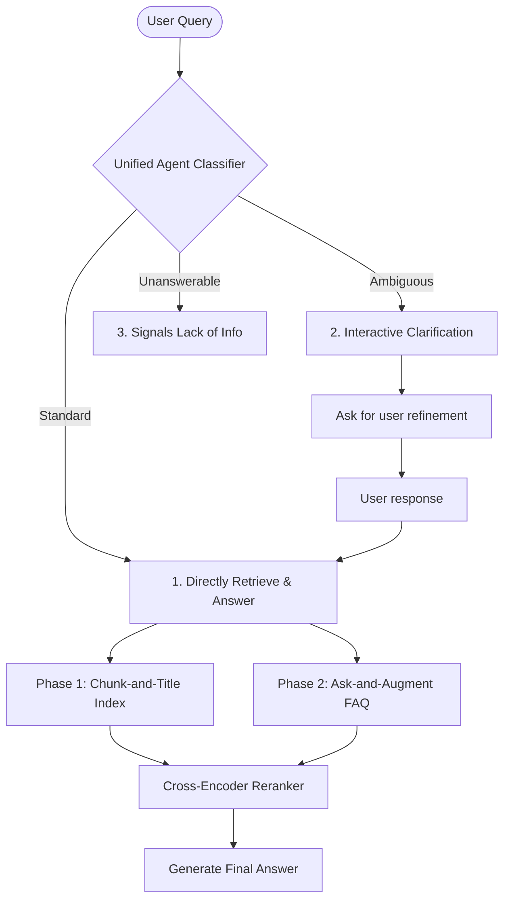

tags:: [[paper]], [[vietnamese-nlp]], [[agentic-rag]], [[baseline]]

# [[HCMUT URA Lab 2025 - URASys]]

## TL;DR
URASys is an agentic question answering framework that addresses the limits of Large Language Models in closed-domain environments, particularly for low-resource languages like Vietnamese. It introduces a unified intent classification system to systematically handle standard, ambiguous, and unanswerable user queries. Rather than blindly guessing, the system uses interactive clarification or explicit rejection to ensure high factual safety.

## Method
The authors implemented a dual-phase indexing pipeline combined with a unified retrieval agent. First, raw documents are processed into coherent text blocks with concise semantic titles (Chunk-and-Title indexing), and an LLM generates a dense FAQ corpus from these blocks (Ask-and-Augment indexing). When a query enters, an intent classification subagent detects if the question lacks constraints (prompting the user with clarifying options) or is completely out-of-domain (returning a safety rejection signal based on retrieval confidence scores).

## Results
*   **Dataset/Evaluation:** Evaluated on Vietnamese open-domain QA benchmarks including academic advising tasks.
*   **Performance:** Drastically reduced model hallucinations on unanswerable and ambiguous queries by establishing strict, calibrated thresholding on cross-encoder reranked retrieval scores.
*   **Index Efficiency:** The Ask-and-Augment FAQ matching significantly improved retrieval recall compared to naive passage retrieval in colloquial Vietnamese.

## Relevance
This is our primary Vietnamese conversational baseline.
*   **What we borrow:** The unanswerable rejection logic. We will explicitly evaluate this using our dedicated adversarial subsets in our **ViWiki-MHR** dataset. When encountering these, our agent should output an explicit "I don't know" rather than inventing answers, validating the system's safe local deployment.
*   **What we adapt:** The retrieval system. While URASys relies on flat, document-based text indexing, we are designing a highly optimized, fully local hybrid search tool `text_search(query, k)` that combines dense vector retrieval (Qdrant/FAISS using `bge-m3` on CPU) with a sparse BM25 index over Vietnamese Wikipedia paragraphs.
*   **What we avoid:** General semantic FAQ databases. We will utilize an ontology-driven local Knowledge Graph (Neo4j) to handle multi-hop logic structurally, using `text_search` strictly as a fallback tool.

