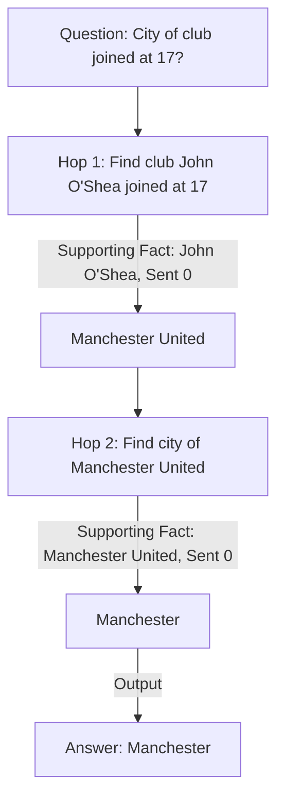

tags:: [[paper]], [[vietnamese-nlp]], [[multi-hop-qa]], [[evaluation]]

# [[Le et al. 2022 - ViMQA]]

## TL;DR
ViMQA is a human-generated multi-hop question answering dataset designed to support explainable QA and advanced logical reasoning in the Vietnamese language. Unlike previous single-paragraph span-extraction corpora, it requires systems to connect disjoint pieces of evidence scattered across multiple Wikipedia articles to retrieve both the final answer and its sentence-level supporting facts.

## Method
The authors constructed the dataset using a human-in-the-loop pipeline based on Wikipedia articles. Annotators were presented with related paragraphs (e.g., bridge entities, intersections, comparisons) and instructed to draft complex, multi-hop questions, identify the final correct answer, and explicitly select the precise sentence-level supporting facts (evidence statements) required to justify the inference path.

## Results
*   **Dataset Size:** 10,047 total QA pairs, split into 8,041 (Training), 1,003 (Development), and 1,003 (Test) records.
*   **Reasoning Types:** Bridge reasoning (60% of the dataset), comparisons, and Yes/No intersection checks.
*   **Evaluation Metrics:**
    *   **Answer EM/F1:** Exact Match and word-segmentation-aware F1 score for the final answer.
    *   **Supporting Facts EM/F1:** Precision, Recall, and F1 score of the predicted sentence-level evidence keys (represented as `[article_title, sentence_index]` pairs).
    *   **Joint EM/F1:** Multiplicative metrics combining both metrics ($\text{Joint F1} = \text{Answer F1} \times \text{Supporting Facts F1}$).

## Relevance
While ViMQA is the closest academic prior work in Vietnamese multi-hop reasoning, it has severe distribution restrictions that motivate our research path:
*   **Access & Reproducibility Gaps:** Access to ViMQA is restricted by a user agreement, and dataset distribution requires bilateral correspondence with the authors. This EULA gate limits downstream commercial reuse and presents hurdles for open, reproducible research.
*   **Clean Break / Zero Derivative Use:** We do not redistribute, train on, or evaluate our models on any VIMQA data. Our dataset, **ViWiki-MHR**, is independently constructed over Vietnamese Wikipedia.
*   **Independent Positioning:** Rather than "superseding" VIMQA, we position ViWiki-MHR as an **open alternative**. This supports our local sovereignty pitch: we provide a 30K+ example CC-BY-SA benchmark on Hugging Face with a fully open construction pipeline.
*   **Benchmark Capabilities:** We cite ViMQA for its multi-hop taxonomies and structural formatting (bridge vs. intersection reasoning), but we do not execute cross-dataset evaluations on their gated test set.

---

## Verbatim Examples

### Example 1: Bridge Entity (Footballer Career)

*   **Question (`question`):** 
    "Câu lạc bộ mà John O'Shea gia nhập khi anh ấy 17 tuổi nằm ở thành phố nào?"
    *(Which city is the club located in, that John O'Shea joined when he was 17 years old?)*
*   **Answer (`answer`):** 
    "Manchester"
*   **Supporting Facts (`supporting_facts`):**
    1. `["John O'Shea", 0]`
    2. `["Manchester United", 0]`
*   **Context (`context`):**
    *   **Paragraph 1: John O'Shea**
        *   `[0]` "John O'Shea bắt đầu sự nghiệp chuyên nghiệp tại Manchester United sau khi gia nhập câu lạc bộ vào năm 17 tuổi." *(John O'Shea started his professional career at Manchester United after joining the club at the age of 17.)*
        *   `[1]` "Anh là một cầu thủ đa năng có thể đá nhiều vị trí." *(He was a versatile player who could play in multiple positions.)*
    *   **Paragraph 2: Manchester United**
        *   `[0]` "Manchester United là một câu lạc bộ bóng đá chuyên nghiệp có trụ sở tại thành phố Manchester, Anh." *(Manchester United is a professional football club based in the city of Manchester, England.)*
        *   `[1]` "Sân nhà của câu lạc bộ là Old Trafford." *(The club's home ground is Old Trafford.)*

### Example 2: Intersection Reasoning (Historical / Literary)

*   **Question (`question`):** 
    "Tác phẩm 'Tắt đèn' được sáng tác bởi nhà văn sinh năm bao nhiêu?"
    *(In what year was the author of the literary work 'Tat den' born?)*
*   **Answer (`answer`):** 
    "1896"
*   **Supporting Facts (`supporting_facts`):**
    1. `["Tắt đèn", 0]`
    2. `["Ngô Tất Tố", 0]`
*   **Context (`context`):**
    *   **Paragraph 1: Tắt đèn**
        *   `[0]` "Tắt đèn là một trong những tác phẩm văn học tiêu biểu nhất của nhà văn Ngô Tất Tố." *(Tat den is one of the most representative literary works of writer Ngo Tat To.)*
        *   `[1]` "Tác phẩm phản ánh cuộc sống lầm than của người nông dân Việt Nam thời kỳ phong kiến thực dân." *(The work reflects the miserable life of Vietnamese peasants during the feudal colonial period.)*
    *   **Paragraph 2: Ngô Tất Tố**
        *   `[0]` "Ngô Tất Tố (sinh năm 1896 – mất năm 1954) là một nhà văn, nhà báo, nhà khảo cứu nổi tiếng của Việt Nam." *(Ngo Tat To (born 1896 – died 1954) was a famous Vietnamese writer, journalist, and researcher.)*

### Example 3: Comparison / Attribute Matching (Geography)

*   **Question (`question`):** 
    "Sông Đà hay sông Đồng Nai dài hơn?"
    *(Is the Da River or the Dong Nai River longer?)*
*   **Answer (`answer`):** 
    "Sông Đà" *(Da River)*
*   **Supporting Facts (`supporting_facts`):**
    1. `["Sông Đà", 0]`
    2. `["Sông Đồng Nai", 0]`
*   **Context (`context`):**
    *   **Paragraph 1: Sông Đà**
        *   `[0]` "Sông Đà là phụ lưu lớn nhất của sông Hồng, có chiều dài khoảng 910 km." *(The Da River is the largest tributary of the Red River, with a length of about 910 km.)*
    *   **Paragraph 2: Sông Đồng Nai**
        *   `[0]` "Sông Đồng Nai là dòng sông nội địa dài nhất Việt Nam, có chiều dài khoảng 586 km." *(The Dong Nai River is the longest domestic river in Vietnam, with a length of about 586 km.)*
