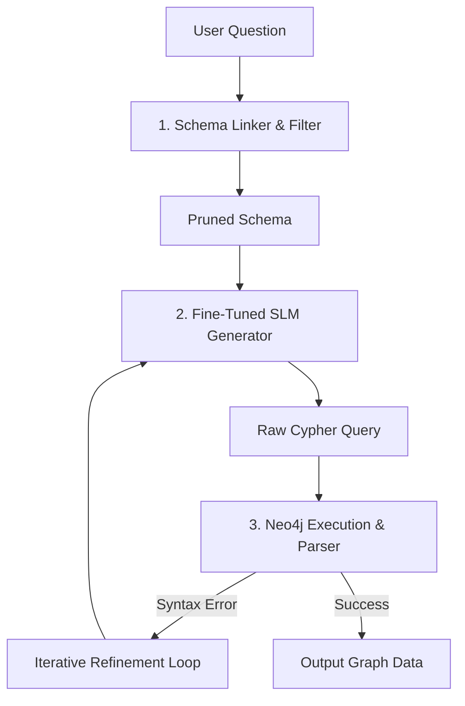

tags:: [[paper]], [[text2cypher]], [[knowledge-graph]], [[translation]]

# [[Ozsoy et al. 2025 - Text2Cypher]]

## TL;DR
This paper introduces key methods for optimizing the Text-to-Cypher translation task, focusing on schema pruning and multilingual adaptation of Large Language Models (LLMs). The authors demonstrate that fine-tuning small models to map natural language queries directly into graph database structures (Cypher) provides a low-latency, highly precise alternative to raw text chunk retrieval.

## Method
The authors built the Neo4j Text2Cypher (2024) benchmark dataset and established three core pipeline methods: Schema Filtering/Pruning, Multilingual fine-tuning, and Iterative refinement. Schema Filtering dynamically retrieves and passes only relevant node labels, relationship types, and properties to the generator model context, stripping out irrelevant schema elements. Multilingual fine-tuning optimizes small models (7B parameters) to translate English, Spanish, and Turkish queries directly into the structural database keys, and Iterative refinement feeds parser error metadata back to the generator to correct syntax issues.

## Results
*   **Dataset Volume:** Curated and released a major Text2Cypher training set containing 44,387 records.
*   **Fine-Tuning Efficiency:** Schema-filtered prompts reduced prompt token overhead, allowing 7B parameter Small Language Models (SLMs) to match or exceed the query translation accuracy of larger closed-source models.
*   **Error Reduction:** The iterative loop successfully recovered syntax errors, reducing compilation failures in graph database execution.

## Relevance
This provides the direct blueprint for our primary QLoRA fine-tuning task.
*   **What we borrow:** The schema-conditioned training paradigm. Our fine-tuned SLM will learn to translate Vietnamese questions directly into Neo4j Cypher queries using schema definitions. We will build a cached `kg_schema()` tool to pull node labels, relationships, and properties, injecting this context for free after the first call.
*   **What we adapt:** The training pipeline. We will generate ~10-15K (Vietnamese question, Cypher) pairs by walking our extracted KG to construct query templates, and using a frontier model to write natural Vietnamese equivalent questions.
*   **What we avoid:** Heavy online self-correction loops. Due to our 6-iteration cap constraint in the ReAct loop, we cannot afford multiple conversational correction passes. We rely on QLoRA training quality to guarantee high first-pass compilation rates, routing Cypher execution errors directly into the agent's observation space.

