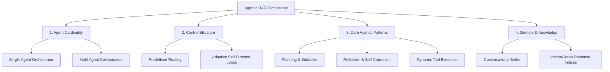
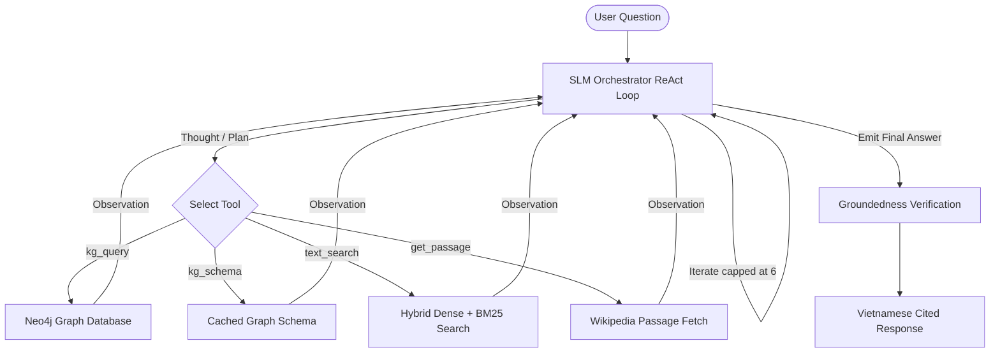

tags:: [[paper]], [[survey]], [[agentic-systems]], [[graph-rag]]

# [[Singh et al. 2025 - Agentic RAG Survey]]

## TL;DR
This comprehensive survey maps the transition from static, linear RAG pipelines to autonomous, adaptive Agentic RAG systems. The authors analyze how embedding autonomous AI agents with specialized roles, planning pipelines, and reflection loops resolves complex, multi-hop reasoning tasks where traditional RAG configurations consistently fail.

## Taxonomy & Landscape Classification
The authors categorize Agentic RAG frameworks across four critical structural dimensions:

## Core Paradigms
The survey details four foundational agentic patterns that drive modern Agentic RAG architectures:

### 1. Planning & Task Decomposition
The system uses an orchestrator agent to unpack complex user queries into discrete subtasks. These subtasks are executed either sequentially or in parallel, allowing the retrieval layer to target specific, narrow facts rather than attempting a single, massive vector search.

### 2. Self-Reflection & Iterative Correction
Before generating a final response, a reflection agent evaluates the retrieved context and intermediate generation drafts for correctness. If factual errors, ambiguities, or syntax compilation bugs are detected, the loop triggers a self-correction pass, re-querying the database with updated parameters.

### 3. Dynamic Tool Use
Rather than hardcoding the retrieval source, the agent dynamically decides at runtime which database, API, or retrieval module to execute based on the user's prompt (e.g., routing factual queries to a graph database and conversational queries to a memory buffer).

### 4. Multi-Agent Collaboration
Tasks are distributed across specialized agents with strict roles (e.g., a retrieval specialist agent, a code-writer agent, and a validator agent) that communicate via structured protocols to construct the final response.

## Open Challenges & Research Horizons
1.  **Extreme Latency:** Multi-agent dialogue loops and iterative generation passes cause high computational overhead, making sub-second user interactions difficult to achieve.
2.  **Coordination Collapse:** Subagents failing to pass correct variables or getting stuck in infinite self-correction loops.
3.  **Explainability Gap:** Complex multi-agent execution traces are difficult to debug, audit, and explain to users compared to simple linear pipelines.

## Relevance to our Vietnamese KGQA System
This survey provides the direct conceptual justification for our agentic QA architecture.
*   **What we borrow:** The planning, reflection, and tool-use design patterns. We will implement these directly by coordinating specialized tools within a controlled ReAct loop (*Thought -> Action -> Observation -> ...*) executed by our fine-tuned 7B SLM orchestrator.
*   **What we adapt:** Narrow, hardcoded tool access. Small models get confused easily by broad decision surfaces. We strictly limit the SLM's toolset to four functional tools:
    1. `kg_query(cypher)`: Runs a Cypher query on our local database.
    2. `kg_schema()`: Retrieves node, relation, and property definitions (cached to be free after first call).
    3. `text_search(query, k)`: Falls back to hybrid dense (vector CPU) + sparse (BM25) search.
    4. `get_passage(passage_id)`: Fetches a specific paragraph by ID to verify citations.
*   **What we avoid:** Complex multi-agent communication or infinite self-correction runs. To bypass the "extreme latency" and "coordination collapse" bottlenecks identified in the survey, we consolidate all planning inside a single-process pipeline and enforce a **hard cap of 6 iterations max** before forcing answer generation.

