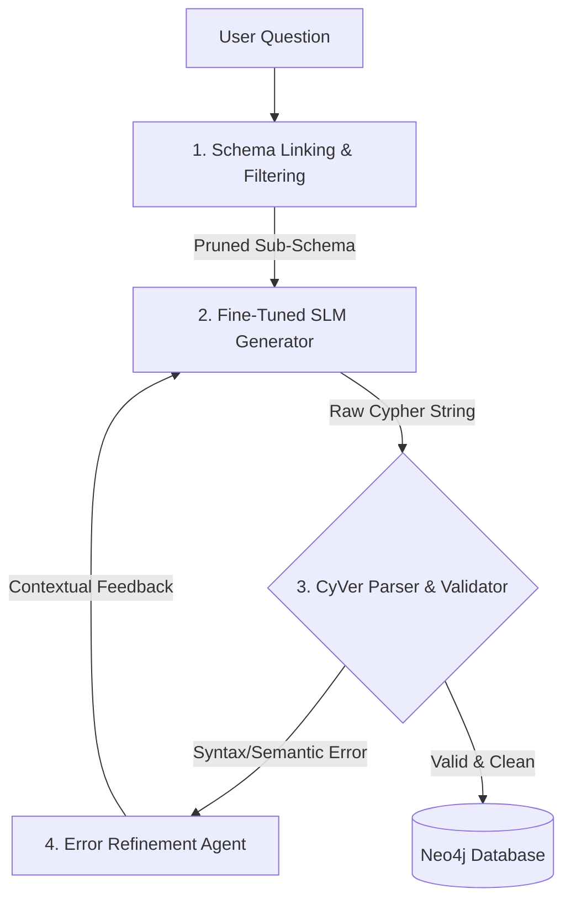

# Text2Cypher Translation

Text-to-Cypher (Text2Cypher) is the translation layer that bridges natural language questions and graph databases. By fine-tuning Small Language Models (SLMs) to generate structured Cypher queries, we replace highly latency-prone semantic context windows with execution-aware graph lookups.

---

## The Text2Cypher Pipeline

A high-performance translation pipeline cannot rely on raw LLM generation. Inspired by Ozsoy et al. 2025 and CyVerACT (2026) architectures, we divide translation into four robust stages:



### 1. Schema Linking & Filtering
*   **Purpose:** Keeps the context window tiny and prevents label hallucination.
*   **Action:** 
    1.  Uses a TF-IDF or BM25 index over all node labels, property keys, and relationship types in the Neo4j database.
    2.  Extracts nouns and verbs from the Vietnamese question (e.g., "tác phẩm Tắt đèn" -> matches label `TácPhẩm` and entity node `Ngô Tất Tố`).
    3.  Outputs a pruned sub-schema containing only the matching elements (e.g., `Node: TácPhẩm`, `Node: NhàVăn`, `Relationship: SÁNG_TÁC`).
    4.  In our system design, the agent calls `kg_schema()` which returns cached schema definitions.

### 2. Fine-Tuned SLM Generation
*   **Purpose:** Translates natural language into structural Cypher strings.
*   **Action:** 
    *   An instruction-tuned 7B model (trained via QLoRA) processes the pruned schema, few-shot translation pairs, and the user's question.
    *   Generates a clean Cypher query mapping the exact traversal path.

### 3. Schema-Aware CyVer Validation
*   **Purpose:** Ensures syntax safety and halts hallucinations prior to database execution.
*   **Action:** A deterministic parser verifies:
    *   **Syntax correctness:** No dangling parenthesis or invalid variable references.
    *   **Schema alignment:** Ensures every label (e.g., `NhàVăn`) and edge (e.g., `[:SÁNG_TÁC]`) actually exists in the active schema.
    *   **Security check:** Strips destructive clauses (e.g., `DELETE`, `DETACH`, `CREATE`).

### 4. Error-Driven Refinement Loop
*   **Purpose:** Auto-corrects minor syntax slip-ups.
*   **Action:** If validation fails, the compiler output is passed into the prompt of a refiner agent to instantly correct the query. In our local system, this is handled within the 6-iteration capped ReAct agent loop. The database error is returned as an observation, guiding the SLM to rewrite the query.

---

## Multi-Hop Vietnamese-to-Cypher Mapping

Here is a concrete example demonstrating how a 2-hop question is processed by the pipeline:

### Input Question
*   **Vietnamese:** "Tác phẩm 'Tắt đèn' được sáng tác bởi nhà văn sinh năm bao nhiêu?"
*   **English Equivalent:** "In what year was the author of the literary work 'Tat den' born?"

### Pruned Sub-Schema
```json
{
  "node_labels": ["TácPhẩm", "NhàVăn"],
  "relationship_types": ["SÁNG_TÁC"],
  "properties": {
    "TácPhẩm": ["tên"],
    "NhàVăn": ["tên", "năm_sinh"]
  }
}
```

### Generated Cypher Query
```cypher
MATCH (tp:TácPhẩm {tên: "Tắt đèn"})<-[:SÁNG_TÁC]-(nv:NhàVăn)
RETURN nv.năm_sinh AS năm_sinh
```

### Execution Analysis
1.  **Traverses direct edge:** Neo4j immediately locates the node `TácPhẩm` with name "Tắt đèn".
2.  **Hops backwards:** Follows the incoming `SÁNG_TÁC` edge to the `NhàVăn` node (*Ngô Tất Tố*).
3.  **Extracts property:** Retrieves the `năm_sinh` property (*1896*).
4.  **Supporting Facts Logging:** Because the query returns the exact nodes traversed, our database wrapper instantly knows that the supporting facts are `["Tắt đèn", 0]` and `["Ngô Tất Tố", 0]`, satisfying ViWiki-MHR's strict groundedness requirements.
