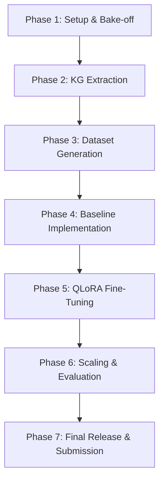

# Project Roadmap and Reading Strategy

This document maps our implementation roadmap alongside a progressive reading strategy linking all 28 unified literature notes in our Obsidian vault.

---

## 1. Implementation Roadmap



### Phase Milestones
*   **Phase 1 Milestone: Base SLM** - Base SLM candidate selected, running in 4-bit locally, and first hello-world text generated.
*   **Phase 2 Milestone: End-to-End Baseline** - Local KG store populated and end-to-end ReAct pipeline running on a 100-question sample.
*   **Phase 3 Milestone: Text-to-Cypher Adapter** - Fine-tuned QLoRA Text-to-Cypher adapter outperforming the base SLM by a measurable margin.
*   **Phase 4 Milestone: Comprehensive Evaluation** - Benchmark evaluation metrics compiled, results tables completed, and system compared against baseline modes.

---

## 2. Integrated Reading Strategy

We organize all 28 paper and survey notes in our vault into a sequential learning hierarchy to support each phase of our timeline.

```
                  +----------------------------------------------+
                  |           Phase 1: The Core Target           |
                  |       [[Le et al. 2022 - ViMQA]]             |
                  +----------------------+-----------------------+
                                         |
                                         v
                  +----------------------+-----------------------+
                  |     Phase 2: RAG & Orchestrator Loops        |
                  |  [[Gao et al. 2024 - RAG for LLMs Survey]]   |
                  |  [[Singh et al. 2025 - Agentic RAG Survey]]  |
                  |  [[Fan et al. 2024 - RAG Meeting LLMs Survey]]|
                  |  [[SoK Team 2026 - Agentic RAG]]             |
                  |  [[Wang et al. 2026 - HiGraAgent]]           |
                  |  [[Verma et al. 2026 - ReflectiveRAG]]       |
                  +----------------------+-----------------------+
                                         |
                                         v
                  +----------------------+-----------------------+
                  |     Phase 3: Vietnamese NLP & QA Baselines   |
                  |  [[HCMUT URA Lab 2025 - URASys]]             |
                  |  [[Nguyen et al. 2025 - HisGraphRAG]]        |
                  |  [[ViWiQA Team 2023 - ViWiQA]]               |
                  |  [[ViHERMES Team 2026 - ViHERMES]]           |
                  |  [[Trinh et al. 2025 - VietMedKG]]           |
                  |  [[MARAUS Team 2025 - MARAUS]]               |
                  |  [[ViHallu Team 2026 - ViHallu]]             |
                  +----------------------+-----------------------+
                                         |
                                         v
                  +----------------------+-----------------------+
                  |     Phase 4: Hybrid Routing & Verification   |
                  |  [[Edge et al. 2024 - Microsoft GraphRAG]]   |
                  |  [[Ozsoy et al. 2025 - Text2Cypher]]         |
                  |  [[Androna et al. 2026 - CyVerACT]]          |
                  |  [[Zhou et al. 2026 - BRINK]]                |
                  |  [[RAGRouter Team 2026 - RAGRouter-Bench]]   |
                  |  [[C2RAG Team 2026 - C2RAG]]                 |
                  |  [[HybridRAG Team 2026 - HybridRAG]]         |
                  +----------------------+-----------------------+
                                         |
                                         v
                  +----------------------+-----------------------+
                  |      Phase 5: Fine-Tuning & Alignment        |
                  |  [[Sailor2 Team 2025 - Sailor2]]             |
                  |  [[Qwen Team 2025 - Qwen2.5]]                |
                  |  [[Dettmers et al. 2023 - QLoRA]]            |
                  |  [[Rafailov et al. 2023 - DPO]]              |
                  |  [[TinyLLM Team 2025 - TinyLLM]]             |
                  |  [[Birkholm et al. 2025 - Efficient Agentic]]|
                  |  [[Ozsoy et al. 2026 - Text2Cypher Fusion]]  |
                  +----------------------------------------------+
```

### Step 1: The Core Target
*   **Literature:** [[Le et al. 2022 - ViMQA]]
*   **Target:** Study standard multi-hop structures (Bridge, Intersection, Comparison) and ground truth F1 metrics to align our dataset targets.

### Step 2: RAG & Orchestrator Loops
*   **Literature:** [[Gao et al. 2024 - RAG for LLMs Survey]], [[Singh et al. 2025 - Agentic RAG Survey]], [[Fan et al. 2024 - RAG Meeting LLMs Survey]], [[SoK Team 2026 - Agentic RAG]], [[Wang et al. 2026 - HiGraAgent]], and [[Verma et al. 2026 - ReflectiveRAG]].
*   **Target:** Understand Naive/Advanced/Modular RAG transitions, the RAG Triad, and single-agent ReAct tool-routing structures. We incorporate ReflectiveRAG's self-reflective evaluation passes to trigger secondary graph walks when retrieved facts are insufficient.

### Step 3: Vietnamese NLP & QA Baselines
*   **Literature:** [[HCMUT URA Lab 2025 - URASys]], [[Nguyen et al. 2025 - HisGraphRAG]], [[ViWiQA Team 2023 - ViWiQA]], [[ViHERMES Team 2026 - ViHERMES]], [[Trinh et al. 2025 - VietMedKG]], [[MARAUS Team 2025 - MARAUS]], and [[ViHallu Team 2026 - ViHallu]].
*   **Target:** Analyze HCMUT's out-of-domain unanswerable classification patterns, Hoang et al.'s regional Vietnamese GraphRAG entity-linking benchmarks, and legal/medical graph configurations (ViHERMES, VietMedKG). We map MARAUS admissions agent verification paths and integrate ViHallu templates to evaluate our local SLM's hallucination rate.

### Step 4: Hybrid Routing & Verification
*   **Literature:** [[Edge et al. 2024 - Microsoft GraphRAG]], [[Ozsoy et al. 2025 - Text2Cypher]], [[Androna et al. 2026 - CyVerACT]], [[Zhou et al. 2026 - BRINK]], [[RAGRouter Team 2026 - RAGRouter-Bench]], [[C2RAG Team 2026 - C2RAG]], and [[HybridRAG Team 2026 - HybridRAG]].
*   **Target:** Establish local schema filtering, map queries to Cypher statements, and implement execution-aware compile-error propagation in the ReAct loop (CyVerACT). We use BRINK's pruned-graph methodology to guide our programmatic broken-link unanswerable generation script and integrate C2RAG dynamic textual recovery rules.

### Step 5: Fine-Tuning & Alignment
*   **Literature:** [[Sailor2 Team 2025 - Sailor2]], [[Qwen Team 2025 - Qwen2.5]], [[Dettmers et al. 2023 - QLoRA]], [[Rafailov et al. 2023 - DPO]], [[TinyLLM Team 2025 - TinyLLM]], [[Birkholm et al. 2025 - Efficient Agentic Tool Calling]], and [[Ozsoy et al. 2026 - Text2Cypher Adapter Fusion]].
*   **Target:** Load quantized `Sailor2-8B` base model weights in 4-bit NormalFloat (NF4), run parameter-efficient QLoRA adapter updates on consumer GPUs, and apply preference optimization (DPO) following efficient edge function-calling recipes. We use adapter fusion principles to evaluate multi-source cross-lingual weights transfer.
